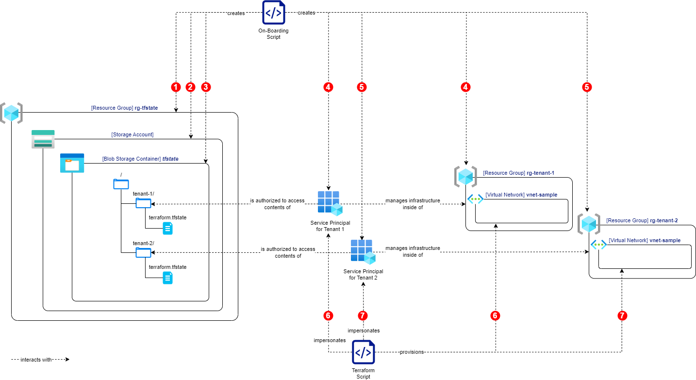

# azure-blob-abac-tfstate

This repository offers guidance on securely using a single Azure Blob Container as the state backend storage for a multi-tenant solution managed by Terraform.

## Introduction

Multi-tenant cloud solutions sometimes require tenant-specific resources to be provisioned.
Managing multiple `tfstate` files in a shared Azure Blob Container requires careful design of the access policies.
[ABAC](https://learn.microsoft.com/en-us/azure/storage/blobs/storage-auth-abac)-rules can be leveraged to ensure that Terraform only gets access to the state files of the tenant that requires infrastructural changes.

## Before you start

Reopen this repository inside of the provided [`devcontainer`](https://code.visualstudio.com/docs/devcontainers/containers).
All dependencies will come pre-installed.
You will need an Azure Subscription to perform the steps mentioned below.

## Step-By-Step Guide

The following steps will provision the following architecture:



### 0. Login and Register Resource Providers

```bash
az login
./scripts/register-providers.sh
```

### 1.+2.+3. Create the Storage Account

Since storage account names must be unique, replace the placeholder with an available name.

```bash
./scripts/create-storage-account.sh "<UNIQUE_STORAGE_ACCOUNT_NAME>"
```

### 4. Onboard Tenant 1

Since service principal names must be unique, replace the placeholder with an available name.

```bash
./scripts/onboard-tenant.sh "<UNIQUE_STORAGE_ACCOUNT_NAME>" "<UNIQUE_SP_NAME_1>" "tenant-1"
```

### 5. Onboard Tenant 2

Since service principal names must be unique, replace the placeholder with an available name.

```bash
./scripts/onboard-tenant.sh "<UNIQUE_STORAGE_ACCOUNT_NAME>" "<UNIQUE_SP_NAME_2>" "tenant-2"
```

### 6. Provision Infrastructure of Tenant 1

Now everything is in place to terraform the infrastructure for tenant 1.

```bash
./scripts/provision-tenant-infra.sh "tenant-1" "tenant-1"
```

### 7. Provision Infrastructure of Tenant 2

Proceed with tenant 2.

```bash
./scripts/provision-tenant-infra.sh "tenant-2" "tenant-2"
```

### Test the Access Rules

The access rules can be validated by trying to modify infrastructure of `tenant-2` while impersonating `tenant-1` (or vice versa):

```bash
./scripts/provision-tenant-infra.sh "tenant-1" "tenant-2"
./scripts/provision-tenant-infra.sh "tenant-2" "tenant-1"
```

The returned error message indicates that reading the Terraform state file failed, which is expected behaviour.

## Understand the ABAC conditions

The attribute-based access conditions look as follows:

```bash
(
    (
        !(ActionMatches{'Microsoft.Storage/storageAccounts/blobServices/containers/blobs/write'})
        AND
        !(ActionMatches{'Microsoft.Storage/storageAccounts/blobServices/containers/blobs/add/action'})
        AND
        !(ActionMatches{'Microsoft.Storage/storageAccounts/blobServices/containers/blobs/delete'})
        AND
        !(ActionMatches{'Microsoft.Storage/storageAccounts/blobServices/containers/blobs/move/action'})
        AND
        !(ActionMatches{'Microsoft.Storage/storageAccounts/blobServices/containers/blobs/read'} AND NOT SubOperationMatches{'Blob.List'})
    )
    OR 
    (
        @Resource[Microsoft.Storage/storageAccounts/blobServices/containers/blobs:path] StringLikeIgnoreCase '$TENANT_ID/*'
    )
)
```

or put differently

```
(
    (
        1st logic expression: Is the operation always allowed?
    )
    OR
    (
        2nd logic expression: Does this particular operation fulfill the access conditions?
    )
)
```

The return value of the overall logic expression (`true` or `false`) determines whether an operation will be allowed.
The first logic expression determines whether the condition defined in the second logic expression needs to be evaluated for the current action.
If not, the first logic block evaluates to `true` and the action will be allowed.
If further inspection is required, the first logic block evaluates to `false` and the second logic expression is evaluated.
In the condition defined above, the return value will be `true` if the path of the blob contains the right tenant identifier.